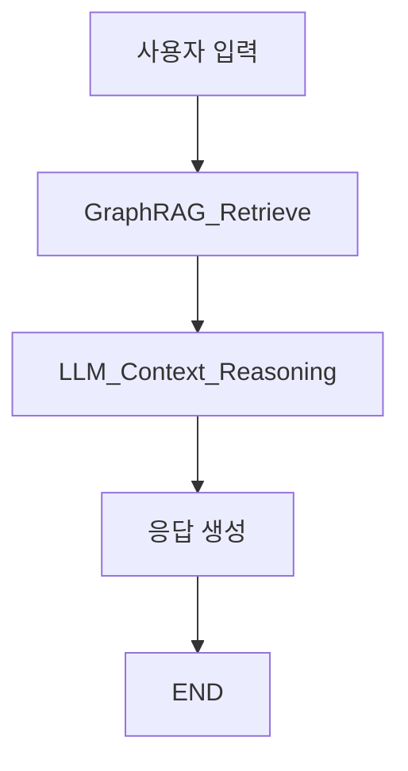

\*\*Graph RAG (Graph-based Retrieval-Augmented Generation)\*\*은 전통적인 RAG 방식에 **그래프 구조**를 추가하여, 정보 간의 **관계성**을 반영한 검색 및 응답 생성을 가능하게 하는 기법임.

---

## 📌 기존 RAG vs Graph RAG

| 항목    | 기존 RAG            | Graph RAG                |
| ----- | ----------------- | ------------------------ |
| 검색 대상 | 독립 문서 (vector 기반) | 노드 & 엣지 구조의 그래프          |
| 정보 연결 | 없음                | 관계 기반 정보 확장 가능           |
| 활용 분야 | QA, 문서 요약         | 지식 추론, 연결된 개념 탐색, 복잡한 QA |

---

## ✅ 핵심 특징

* **그래프 노드**: 개념, 엔티티, 문장 등
* **그래프 엣지**: 관계 (예: 원인 → 결과, 개념 → 정의)
* **RAG 과정에서 그래프 탐색**으로 연관된 정보 다각도로 수집
* 정보 간 관계를 이해하고 추론하는 응답 가능

---

## 🧠 예시

> 사용자: “전기차 배터리 기술의 주요 문제점은?”
> → Graph RAG은 “배터리 기술” → “리튬이온”, “화재 위험”, “충전 속도” 등 관련 노드 탐색
> → 관계 기반 추론 가능

---

## 🔗 사용 기술 예시

* Neo4j, NetworkX 등 그래프 DB + LLM
* LangChain + KG Retriever
* Graph-of-Thought (ToT와 결합 가능)

---

원하면 Graph RAG를 실제 LangChain에서 구현하는 코드 예시도 제공 가능함.


\*\*Graph-of-Thought (GoT)\*\*는 기존의 Chain-of-Thought(CoT) 프롬프팅 기법을 **그래프 구조로 확장한 방식**임. 복잡한 문제 해결에서 여러 개의 추론 경로(=생각)를 병렬로 생성하고, 그것들을 **그래프처럼 연결·평가**하여 최적의 사고 흐름을 선택함.

---

## ✅ 핵심 개념

* **노드(Node)** = 개별 추론 단계 또는 아이디어
* **엣지(Edge)** = 논리적 연결, 결과 의존성
* 여러 생각(사고 흐름)을 그래프 형태로 구조화해 탐색

---

## 🧠 예시

질문: “지구 온난화 해결을 위한 전략은?”
→ 다양한 해결책을 노드로 생성 (탄소세, 재생에너지, 기술혁신 등)
→ 그 사이의 관계(원인/결과/보완)를 그래프로 연결
→ 최적 경로 선택 → 응답 생성

---

## 🚀 왜 쓰나?

| 목적        | 효과                   |
| --------- | -------------------- |
| 복잡한 문제 해결 | 다양한 추론 경로 병렬 탐색      |
| 창의적 사고 유도 | 아이디어 다양화 및 평가 가능     |
| 정보 연결     | 단편적 CoT보다 더 넓은 시야 확보 |

---

## 🧰 관련 기술

* Tree of Thought (ToT) → Graph 구조로 일반화
* LLM + Graph search (Beam Search, BFS, DFS 등)
* LangGraph, OpenDevin, Elicit 등에서 연구·적용 중

---

원하면 GoT 구조의 LangGraph 설계 예제도 만들어줄 수 있어.
어떤 문제에 적용하고 싶은지 알려주면 맞춤형 예제 제공 가능.


좋아, 아래는 **LangChain에서 Graph RAG (Graph-based Retrieval-Augmented Generation)** 구조를 구현하는 기본적인 예시 코드야. 이 예시는 `지식 그래프`를 기반으로 정보를 검색하고 LLM 응답에 활용하는 방식이야.

---

## 🧩 전제

* **지식 그래프**는 네트워크형 노드+엣지 구조 (예: `NetworkX` 또는 `Neo4j`)
* `GraphRetriever`를 직접 만들거나, 커스텀 `Retriever`로 구현 가능

---

## ✅ 예시: NetworkX 기반 Graph RAG

```python
import networkx as nx
from langchain.schema import Document
from langchain.vectorstores import FAISS
from langchain.embeddings.openai import OpenAIEmbeddings
from langchain.chat_models import ChatOpenAI
from langchain.chains import RetrievalQA

# Step 1: 그래프 생성 (예: NetworkX)
G = nx.Graph()
G.add_edge("전기차", "배터리")
G.add_edge("배터리", "리튬이온")
G.add_edge("배터리", "충전 속도")
G.add_edge("리튬이온", "화재 위험")

# Step 2: 노드별 설명 정의
node_docs = {
    "전기차": "전기차는 배터리를 이용한 차량입니다.",
    "배터리": "배터리는 전기 에너지를 저장합니다.",
    "리튬이온": "리튬이온 배터리는 고효율이지만 화재 위험이 있습니다.",
    "충전 속도": "충전 속도는 전기차 실용성에 큰 영향을 줍니다.",
    "화재 위험": "일부 배터리는 고온에서 화재를 일으킬 수 있습니다."
}

# Step 3: 문서화 + 벡터화
docs = [Document(page_content=v, metadata={"title": k}) for k, v in node_docs.items()]
embedding = OpenAIEmbeddings()
vectorstore = FAISS.from_documents(docs, embedding)

# Step 4: 커스텀 Graph-aware Retriever 정의
class GraphRetriever:
    def __init__(self, graph, base_retriever, hops=1):
        self.graph = graph
        self.retriever = base_retriever
        self.hops = hops

    def get_neighbors(self, node):
        return nx.single_source_shortest_path_length(self.graph, node, cutoff=self.hops).keys()

    def retrieve(self, query):
        # 유사한 노드를 먼저 찾고 → 그래프 탐색
        docs = self.retriever.similarity_search(query, k=1)
        start_node = docs[0].metadata["title"]
        neighbor_nodes = self.get_neighbors(start_node)

        all_docs = []
        for node in neighbor_nodes:
            node_doc = [d for d in docs if d.metadata["title"] == node]
            if node_doc:
                all_docs.extend(node_doc)
        return all_docs

# Step 5: QA 체인에 연결
retriever = GraphRetriever(G, vectorstore)
llm = ChatOpenAI(model="gpt-4", temperature=0)

qa_chain = RetrievalQA.from_chain_type(
    llm=llm,
    retriever=retriever,
    return_source_documents=True
)

# Step 6: 질의 수행
query = "전기차 배터리 문제점이 뭐야?"
result = qa_chain({"query": query})

print("📌 답변:", result["result"])
```

---

## 💡 주요 특징

* `GraphRetriever`는 단순 유사도 검색이 아니라 그래프 탐색을 함께 수행함
* 그래프 이웃 노드를 함께 검색하여 **문맥적 확장** 가능
* 일반 벡터 검색보다 **의미 연결성 반영**에 탁월

---

## 🧠 확장 아이디어

* `Neo4j` 사용 시 Cypher 쿼리 기반 탐색 가능
* 엣지 타입 필터링: “원인-결과”, “구성요소”, “유사성” 등
* ToT(Tree of Thought)나 Plan-and-Execute 흐름과 결합 가능

---

필요하면 이 구조를 LangGraph 기반으로도 확장 설계해줄게.
어떤 도메인에 적용하고 싶은지 알려줘!


좋아, 이번엔 **LangGraph 기반 Graph RAG 시스템 아키텍처**를 설계해줄게. 목표는 사용자의 질문을 받아서:

1. Vector Search로 관련 노드를 찾고
2. Knowledge Graph 기반으로 이웃 노드 확장
3. 관련 문서를 수집해
4. LLM이 종합적으로 응답 생성

---

## 🧠 전체 LangGraph 구조 요약



---

## 🧩 상태 정의 (`TypedDict`)

```python
from typing import TypedDict, List
class GraphRAGState(TypedDict):
    query: str
    start_node: str
    graph_docs: List[str]
    answer: str
```

---

## 🔧 Node 1: Graph Retriever Node

```python
def retrieve_with_graph(state: GraphRAGState) -> GraphRAGState:
    query = state["query"]
    docs = vectorstore.similarity_search(query, k=1)
    start_node = docs[0].metadata["title"]
    neighbor_nodes = graph_retriever.get_neighbors(start_node)

    neighbor_docs = []
    for node in neighbor_nodes:
        node_docs = vectorstore.similarity_search(node, k=1)
        neighbor_docs.extend([d.page_content for d in node_docs])
    
    return {
        **state,
        "start_node": start_node,
        "graph_docs": neighbor_docs
    }
```

---

## 🔧 Node 2: LLM Reasoning Node

```python
def llm_reasoning(state: GraphRAGState) -> GraphRAGState:
    context = "\n".join(state["graph_docs"])
    prompt = f"질문: {state['query']}\n관련 정보:\n{context}\n\n답변:"
    answer = llm.invoke(prompt)
    return {**state, "answer": answer}
```

---

## 🧱 LangGraph 조립

```python
from langgraph.graph import StateGraph, END

builder = StateGraph(GraphRAGState)

builder.add_node("graph_retrieve", retrieve_with_graph)
builder.add_node("reason", llm_reasoning)

builder.set_entry_point("graph_retrieve")
builder.add_edge("graph_retrieve", "reason")
builder.add_edge("reason", END)

graph_rag_app = builder.compile()
```

---

## 🧪 실행 예시

```python
result = graph_rag_app.invoke({"query": "전기차 배터리의 주요 문제는?"})
print(result["answer"])
```

---

## 💡 확장 가능성

| 기능                     | 구현 아이디어                      |
| ---------------------- | ---------------------------- |
| 🔁 Graph Traversal 반복  | hops=2 이상, DFS/BFS 순회        |
| 🧠 Graph-of-Thought 적용 | 여러 경로 → 평가 → 최적 선택           |
| 🛠 도구 호출               | 필요 시 외부 문서 검색 API 호출         |
| 🧩 LangChain Agent 결합  | Tool + Planner로 hybrid 구성 가능 |

---

필요하면 이걸 **CrewAI**, **AutoGen**, 또는 **Neo4j 연동 구조**로도 바꿔줄 수 있음. 어느 방향으로 더 확장하고 싶은지 알려줘!


**Neo4j**는 그래프 데이터베이스(Graph Database)의 대표적인 오픈소스 시스템이야. 관계형 DB처럼 테이블을 사용하지 않고, \*\*노드(객체)\*\*와 \*\*엣지(관계)\*\*로 데이터를 저장하고 쿼리해.

---

### ✅ 주요 특징

* 🔗 **관계 중심 구조**: 관계형 DB보다 **복잡한 관계**를 훨씬 빠르게 탐색
* 🧠 **지식 그래프, 추천 시스템, 경로 탐색** 등에 특화
* 💬 쿼리 언어는 **Cypher**라는 SQL과 유사한 DSL 사용
* 🏎️ 관계 기반 검색 속도가 빠름 (특히 깊은 연결 탐색에서)

---

### 📌 예시 구조

```
(:사람 {이름: "영호"})-[:친구]->(:사람 {이름: "지수"})
```

---

### 🧰 주요 활용 분야

* 지식 그래프 (Knowledge Graph)
* 소셜 네트워크 분석
* 금융 사기 탐지
* 제품 추천 시스템
* 의료 데이터 연결

---

원하면 Neo4j에 LangChain 또는 LangGraph를 어떻게 연결하는지도 예제 줄 수 있어.

